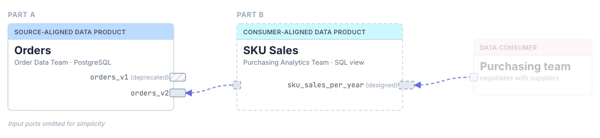

# Exercise 4: Design Your Data Product

**Scenario:** The **purchasing team** wants to know how often each SKU is bought, grouped by year, to negotiate better deals with suppliers. You will build a derived data product on top of the orders data.

You work **contract-first**: before writing any SQL, you design the data contract and the data product description. The contract is the specification — you will implement it in [Exercise 5](exercise5-implement-your-data-product.md).

You consume the `orders_v2` contract — it guarantees you the `quantity` column.



**In this exercise:** the contract and ODPS description of SKU Sales. Designed first, implemented in the next exercise.

## Design the Contract

1. Create a new data contract and open it in the Data Contract Editor (the file does not exist yet, so the CLI asks whether to create it — confirm):

   ```bash
   datacontract edit sku_sales_per_year.odcs.yaml
   ```

   - **Name**: `SKU Sales per Year`
   - **ID**: `sku_sales_per_year`
   - **Version**: `1.0.0`
   - **Status**: `draft`
   
2. Add a **Server**:

   - **Type**: `postgres`
   - **Host**: `localhost`
   - **Port**: `5433`
   - **Database**: `workshop`
   - **Schema**: `analytics`

3. Add a **Schema**
   
   - **Name**: `sku_sales_per_year`
   - **Advanced Metadata** → **Physical Type**: `VIEW`
   - **Properties**:

     | Property         | Logical Type | Physical Type | Meaning                           |
     |------------------|--------------|---------------|-----------------------------------|
     | `sku`            | `string`     | `TEXT`        | The product SKU                   |
     | `year`           | `integer`    | `INTEGER`     | Year of the order                 |
     | `order_count`    | `integer`    | `BIGINT`      | How many orders contained the SKU |
     | `total_quantity` | `integer`    | `BIGINT`      | Total units bought                |

4. Add quality checks that capture the *semantics* of the view, e.g.:
     
   - The combination of `sku` and `year` is unique
   - `total_quantity` is never less than `order_count`
   - The view is not empty

   Documentation: [library metrics](https://docs.datacontract.com/quality-rules/library#supported-metrics) like `duplicateValues` and `rowCount` need no SQL; for everything else, use a [SQL quality rule](https://docs.datacontract.com/quality-rules/sql#schema-level-example).

5. Save the contract and run the tests:

   ```bash
   datacontract test sku_sales_per_year.odcs.yaml
   ```

   The tests **fail** — of course, nothing is implemented yet! That is the point of contract-first:
   consumers can already review the interface while you turn the red tests green in the next exercise.


## Describe the Data Product

6. Create `sku_sales_per_year.odps.yaml`, following the same structure as in [Exercise 3]:
   
   - **ID**: `sku_sales`
   - **Name**: `SKU Sales`
   - **Status**: `draft`
   - **Domain** `ecommerce`

7. Add an **output port** referencing your `sku_sales_per_year` contract — like in [Exercise 3] with `displayName` and the `server` as `customProperties`:

   ```yaml
   outputPorts:
     - name: sku_sales_per_year
       version: 1.0.0
       contractId: sku_sales_per_year
      ```
 
8. Add an **input port** referencing the `orders_v2` contract — this declares which data (and which guarantees!) your product builds on:

   ```yaml
   inputPorts:
     - name: orders
       version: 2.0.0
       contractId: orders_v2
   ```

9. Validate:

   ```bash
   dataproduct lint sku_sales_per_year.odps.yaml
   ```

